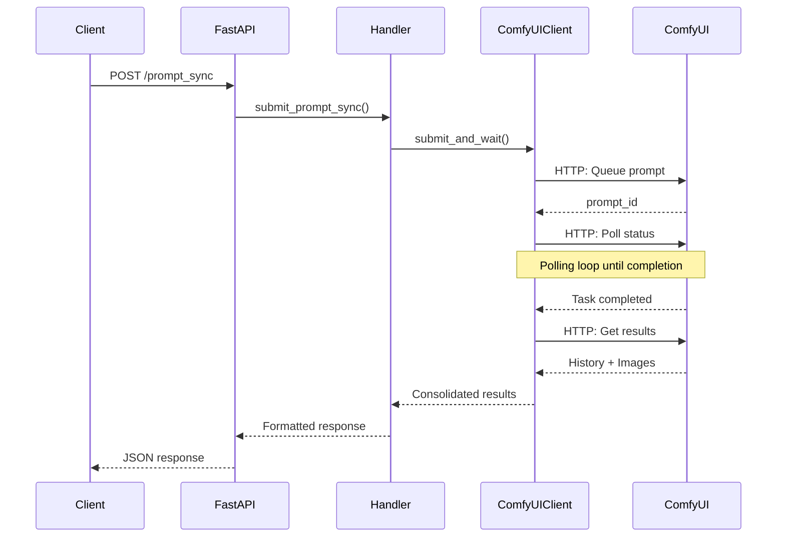

# ComfyUI Handler Implementation Guide

This document provides a detailed technical overview of how the ComfyUI Handler transforms the asynchronous ComfyUI workflow into a synchronous HTTP API service.

## 🎯 Implementation Overview

The ComfyUI Handler serves as a bridge between HTTP REST clients and the ComfyUI HTTP API, providing synchronous request-response patterns through efficient polling mechanisms essential for serverless environments.

## 🏗️ Architecture Components

### Core Components

```
┌─────────────────────────────────────────────────────────────┐
│                    ComfyUI Worker Handler                   │
├─────────────────────────────────────────────────────────────┤
│  ┌─────────────┐  ┌─────────────┐  ┌─────────────┐         │
│  │   FastAPI   │  │   Handler   │  │   Client    │         │
│  │   Server    │──│   Service   │──│   Wrapper   │         │
│  └─────────────┘  └─────────────┘  └─────────────┘         │
│         │                │                │                 │
│         │                │                │                 │
│  ┌─────────────┐  ┌─────────────┐  ┌─────────────┐         │
│  │ Exception   │  │  Config     │  │ HTTP        │         │
│  │ Handling    │  │ Manager     │  │ Polling     │         │
│  └─────────────┘  └─────────────┘  └─────────────┘         │
└─────────────────────────────────────────────────────────────┘
                              │
                              ▼
                   ┌─────────────────┐
                   │   ComfyUI       │
                   │   Server        │
                   │   (Port 8188)   │
                   └─────────────────┘
```

## 📁 Project Structure

```
worker-comfyui/
├── server.py                 # FastAPI application entry point
├── config.py                 # Configuration management
├── client.py                 # Client example
├── comfyui/                  # Core handler package
│   ├── __init__.py
│   ├── client.py            # ComfyUI API client wrapper
│   ├── handler.py           # Main handler service
│   └── exceptions.py        # Custom exception classes
└── deploy/                  # Deployment configurations
    ├── Dockerfile
    ├── supervisord.conf
    └── entrypoint.sh
```

## 🔧 Core Implementation Details

### 1. FastAPI Server (`server.py`)

The FastAPI server provides HTTP endpoints and handles request routing:

```python
# Key endpoints implementation
@app.post("/prompt_sync")
async def submit_prompt_sync(request: PromptRequest, timeout: Optional[int] = None):
    """Synchronous prompt submission - Main serverless endpoint"""
    result = await comfyui_handler.submit_prompt_sync(
        request.prompt, 
        return_image_base64=request.return_image_base64,
        timeout=timeout
    )
    return result

@app.post("/prompt") 
async def queue_prompt(request: PromptRequest):
    """ComfyUI-compatible async endpoint"""
    result = await comfyui_handler.queue_prompt_compatible(
        prompt=request.prompt,
        client_id=request.client_id
    )
    return result
```

**Key Features:**
- **Exception Handling**: Custom exception handlers for ComfyUI-specific errors
- **Request Validation**: Pydantic models for request/response validation
- **Health Checks**: Built-in health monitoring endpoints
- **CORS Support**: Cross-origin resource sharing configuration

### 2. ComfyUI Handler (`comfyui/handler.py`)

The handler service orchestrates the synchronous workflow:

```python
class ComfyUIHandler:
    async def submit_prompt_sync(self, prompt: Dict[str, Any], 
                                return_image_base64: bool = False,
                                timeout: Optional[int] = None) -> Dict[str, Any]:
        """
        Core synchronous submission logic:
        1. Submit prompt to ComfyUI
        2. Wait for completion via polling
        3. Collect results and return
        """
        start_time = time.time()
        
        # Submit task and wait for completion
        result = await self.client.submit_and_wait(prompt, timeout, return_base64=return_image_base64)
        
        # Calculate execution time and build response
        execution_time = round(time.time() - start_time, 2)
        
        response = {
            "prompt_id": result["prompt_id"],
            "status": "success",
            "execution_time": execution_time,
            "outputs": result["history"].get("outputs", {}),
            "node_errors": {}
        }
        
        return response
```

**Key Features:**
- **Timeout Management**: Configurable timeout handling
- **Error Recovery**: Graceful error handling and reporting
- **Execution Tracking**: Built-in execution time measurement
- **Resource Cleanup**: Automatic cleanup of temporary resources

### 3. ComfyUI Client Wrapper (`comfyui/client.py`)

The client wrapper manages communication with the ComfyUI server:

```python
class ComfyUIClient:
    async def submit_and_wait(self, prompt: Dict[str, Any], timeout: int = 300, 
                             return_base64: bool = False) -> Dict[str, Any]:
        """
        Submit prompt and wait for completion:
        1. Queue prompt via HTTP API
        2. Monitor progress via HTTP polling
        3. Collect output images
        4. Return consolidated results
        """
        # Submit task
        prompt_id = await self.queue_prompt(prompt)
        
        # Wait for completion
        history = await self.wait_for_completion(prompt_id, timeout)
        
        # Get image information
        if return_base64:
            images = await self.get_output_images_base64(history)
        else:
            images = await self.get_output_images_info(history)
        
        return {
            "prompt_id": prompt_id,
            "history": history,
            "images": images
        }
```

**Key Features:**
- **HTTP Polling Management**: Efficient HTTP polling for task monitoring
- **Progress Monitoring**: Real-time progress tracking via HTTP polling
- **Image Processing**: Support for both metadata and base64 image data
- **Connection Pooling**: Efficient HTTP connection reuse

### 4. Exception Handling (`comfyui/exceptions.py`)

Comprehensive error handling for different failure scenarios:

```python
class ComfyUIError(Exception):
    """Base exception for ComfyUI-related errors"""

class ComfyUIConnectionError(ComfyUIError):
    """Connection-related errors"""

class ComfyUITimeoutError(ComfyUIError):
    """Timeout-related errors"""

class ComfyUITaskError(ComfyUIError):
    """Task execution errors"""
    def __init__(self, message: str, prompt_id: str = None, node_errors: Dict = None):
        self.prompt_id = prompt_id
        self.node_errors = node_errors or {}
        super().__init__(message)
```

## 🔄 Request Flow

### Synchronous Request Flow



### Key Synchronization Points

1. **Prompt Submission**: HTTP POST to ComfyUI `/prompt` endpoint
2. **Progress Monitoring**: HTTP polling to track execution status
3. **Completion Detection**: Polling loop detecting task completion
4. **Result Collection**: HTTP GET to retrieve execution history and images
5. **Response Formatting**: Standardized JSON response format

## 📊 Performance Optimizations

### 1. Connection Management

```python
# Efficient HTTP session reuse
async with aiohttp.ClientSession() as session:
    # Reuse session for multiple requests
    async with session.post(url, json=data) as response:
        return await response.json()
```

### 2. HTTP Polling Optimization

```python
# Efficient HTTP polling for task completion
async def wait_for_completion(self, prompt_id: str, timeout: int = 300, poll_interval: float = 1.0):
    start_time = time.time()
    while time.time() - start_time < timeout:
        # Check history for completion status
        history = await self.get_history(prompt_id)
        if history is not None and "outputs" in history:
            return history
        
        # Check if task is still in queue
        queue_status = await self.get_queue_status()
        if not self._is_task_in_queue(queue_status, prompt_id):
            # Task finished, get final result
            return await self.get_history(prompt_id)
        
        await asyncio.sleep(poll_interval)
```

### 3. Memory Management

- **Streaming Response**: Large images handled via streaming
- **Connection Pooling**: Efficient resource reuse
- **Garbage Collection**: Explicit cleanup of temporary data

## 🛠️ Configuration Management

### Environment-based Configuration

```python
# config.py
class Config:
    # Server settings
    SERVER_HOST = os.getenv("SERVER_HOST", "0.0.0.0")
    SERVER_PORT = int(os.getenv("SERVER_PORT", "18188"))
    
    # ComfyUI settings
    comfyui_server_address = os.getenv("COMFYUI_SERVER_ADDRESS", "127.0.0.1:8188")
    DEFAULT_TIMEOUT = int(os.getenv("DEFAULT_TIMEOUT", "300"))
    
    # Logging
    LOG_LEVEL = os.getenv("LOG_LEVEL", "INFO")
    LOG_OUTPUT = os.getenv("LOG_OUTPUT", "console")
```

### Runtime Configuration

- **Dynamic Timeout**: Per-request timeout configuration
- **Concurrency Control**: Configurable concurrent request limits
- **Resource Limits**: Memory and CPU usage controls

## 🔍 Monitoring & Observability

### Health Check Implementation

```python
async def health_check(self) -> Dict[str, Any]:
    """Comprehensive health check"""
    try:
        # Test ComfyUI connectivity
        queue_status = await self.client.get_queue_status()
        
        return {
            "status": "healthy",
            "comfyui_server": "connected",
            "queue_running": len(queue_status.get("queue_running", [])),
            "queue_pending": len(queue_status.get("queue_pending", [])),
            "timestamp": time.time()
        }
    except Exception as e:
        return {
            "status": "unhealthy",
            "error": str(e),
            "timestamp": time.time()
        }
```

### Logging Strategy

```python
# Structured logging throughout the application
logger.info(f"Task {prompt_id} submitted successfully")
logger.debug(f"Polling status check: {status}")
logger.error(f"Task {prompt_id} failed: {error}")
logger.warning(f"Task {prompt_id} timeout after {timeout}s")
```

## 🔒 Error Handling Strategy

### 1. Graceful Degradation

- **Connection Failures**: Retry with exponential backoff
- **Timeout Handling**: Clean resource cleanup on timeout
- **Partial Failures**: Return partial results when possible

### 2. Error Classification

```python
# Error mapping for different scenarios
ERROR_MAPPINGS = {
    ConnectionError: ComfyUIConnectionError,
    TimeoutError: ComfyUITimeoutError,
    ValueError: ComfyUIValidationError,
    Exception: ComfyUIServerError
}
```

### 3. Client Error Responses

```python
# Standardized error response format
{
    "error": "Task execution failed",
    "detail": "Node validation error in KSampler",
    "prompt_id": "12345-abcde",
    "node_errors": {
        "3": ["Invalid sampler_name: 'invalid_sampler'"]
    },
    "timestamp": "2024-01-15T10:30:00Z"
}
```

---

This implementation provides a robust, scalable foundation for running ComfyUI workflows in serverless environments while maintaining compatibility with the original ComfyUI API. 