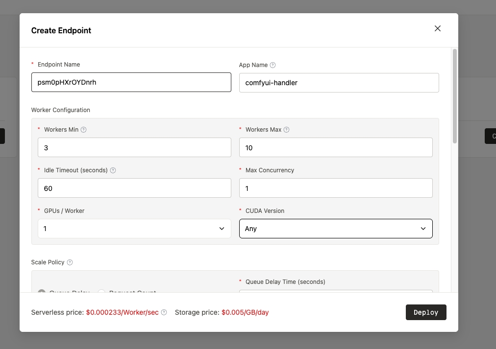
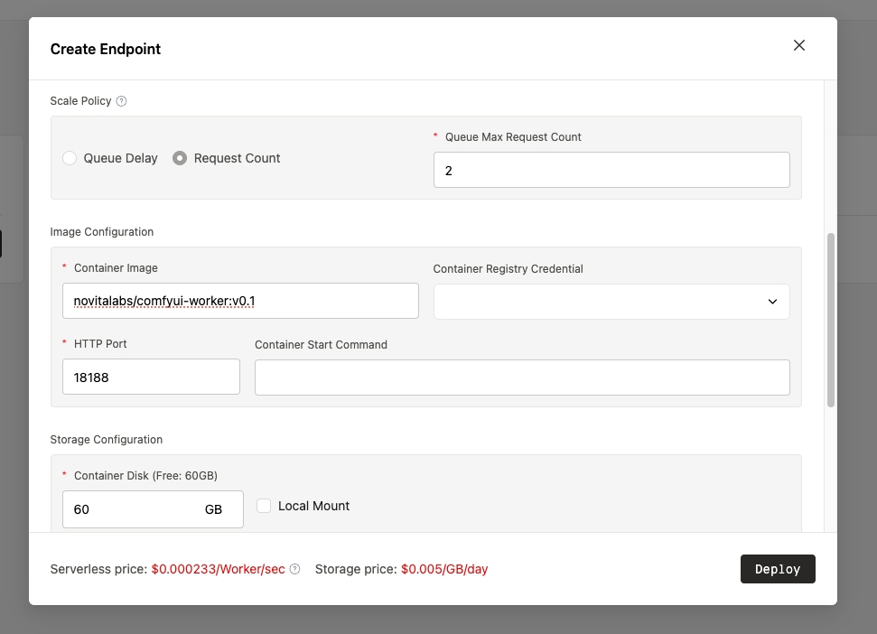
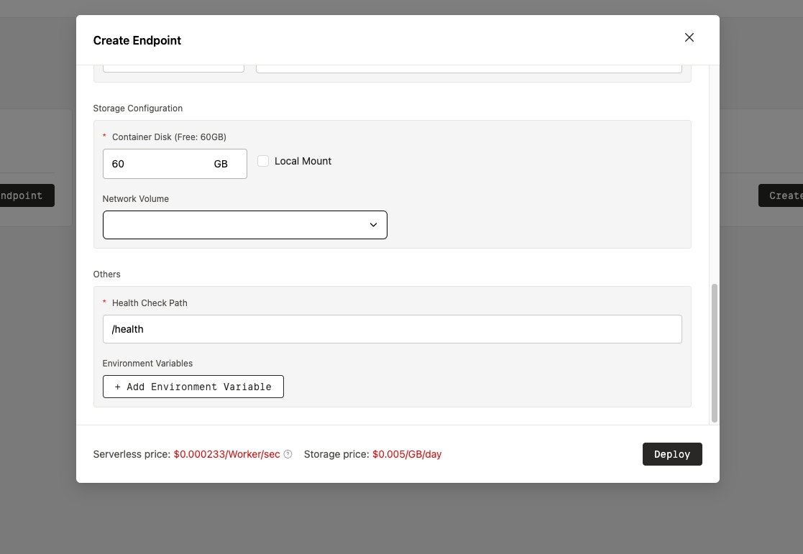
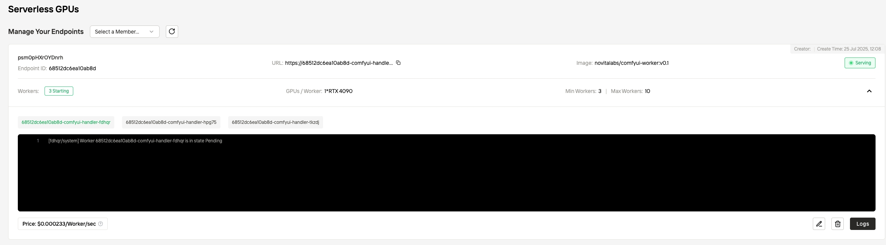
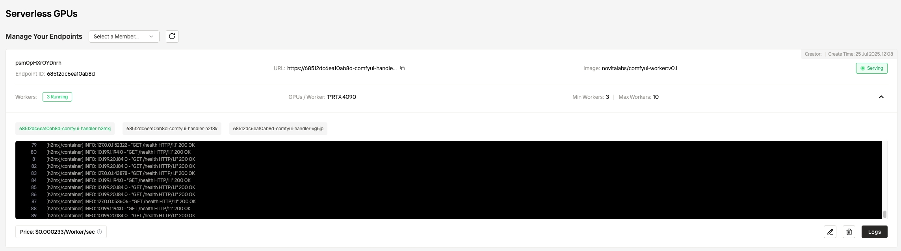
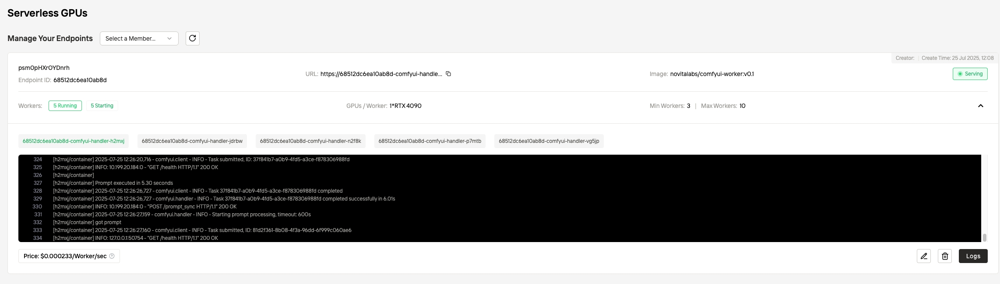

# Deploy ComfyUI Worker on Novita.ai Serverless Platform

This guide provides step-by-step instructions for deploying ComfyUI Worker on Novita.ai's serverless platform with auto-scaling capabilities.

## 🚀 Quick Start

**Docker Image:** `novitalabs/comfyui-worker:v0.1`

## 📋 Prerequisites

- Novita.ai account with serverless access
- Basic understanding of serverless deployment concepts
- Access to the provided Docker image

## 🛠️ Deployment Steps

### Step 1: Create Endpoint and Configure Worker

Configure the endpoint name and worker settings for your ComfyUI Worker deployment.



**Configuration Details:**
- **Endpoint Name**: Choose a descriptive name for your ComfyUI Worker
- **Worker Configuration**: Set up basic worker parameters
- **Resource Allocation**: Configure initial resource requirements

### Step 2: Configure Scaling Policy and Image Settings

Set up the scaling policy, Docker image, and target port configuration.



**Configuration Details:**
- **Docker Image**: `novitalabs/comfyui-worker:v0.1`
- **Target Port**: `18188` (ComfyUI Worker Handler port)
- **Scaling Policy**: Configure minimum and maximum workers
- **Auto-scaling Triggers**: queue delay or request count

### Step 3: Configure Health Check and Storage

Configure health check endpoints and disk storage requirements.



**Configuration Details:**
- **Health Check Endpoint**: `/health`
- **Health Check Port**: `18188`
- **Disk Size**: Recommended 60GB+ for model storage
- **Network Volume**: Optional, configure if using shared model storage

### Step 4: Deploy and Wait for Startup

Deploy the worker and monitor the startup process.



**Deployment Process:**
1. Click "Deploy" button
2. Monitor deployment logs
3. Wait for worker initialization
4. Verify container startup

### Step 5: Access Running Worker

Once the worker status shows "running", access it via the provided URL.



**Access Details:**
- **Status**: Running
- **Endpoint URL**: Available for API calls
- **Health Check**: Verify worker is responding
- **Logs**: Monitor for any startup issues

### Step 6: Chcek Auto-scaling

#### Benchmark Testing Setup

Use the provided benchmark tool to test your deployment and verify auto-scaling:

[uv installation documentation](https://github.com/astral-sh/uv) 


```bash
# Setup Python environment
uv venv
uv pip install -r requirements.txt

# Run benchmark test
uv run docs/examples/benchmark.py \
  --url https://your-endpoint.runsync.novita.dev \
  --concurrent 10 \
  --requests 100
```

#### Sample Benchmark Results

```
Starting benchmark test...
  Server: https://68512dc6ea10ab8d-comfyui-handler.runsync.novita.dev
  Prompts: ['pretty_girl']
  Total requests: 100
  Concurrent requests: 10
------------------------------------------------------------
Health check...
✅ Server is healthy
Generating unique prompts for each request...
Generated 100 unique prompts
Progress: 100/100 (100.0%) - Last: SUCCESS (13.0s)
Benchmark completed in 189.57s

============================================================
BENCHMARK STATISTICS
============================================================
Total Requests:      100
Successful:          100 (100.0%)
Failed:              0 (0.0%)

RESPONSE TIME STATISTICS:
Average:             18.05s
Median:              10.57s
Min:                 5.47s
Max:                 89.99s
Total Time:          1805.14s

EXECUTION TIME STATISTICS:
Average:             8.09s
Median:              8.01s
Min:                 5.01s
Max:                 21.14s
Total Time:          808.61s

THROUGHPUT ANALYSIS:
Requests/second:     0.53
Avg req/sec:         5.54

PROMPT TYPE BREAKDOWN:
  pretty_girl: 100 requests, avg 8.09s
============================================================
```

Check auto-scaling policies for production workloads.




